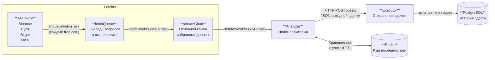

# Crypto Monitor

Сервис по поиску потенциально выгодных арбитражных сделок между криптобиржами. Построен по архитектуре Ports & Adapters, имеет 3 микросервиса, связанных по REST API, с расчетом на удобную миграцию на gRPC.

Роли микросервисов:

- `fetcher` собирает котировки с Binance, Bybit, OKX и BitGet
- `analyzer` пересчитывает спред с учетом реальных комиссий
- `executor` сохраняет статистику по успешным сделкам в БД

## Как это работает

1. `fetcher` с заданной частотой запрашивает цены по отслеживаемым монетам и отправляет их в `analyzer`.
2. `analyzer` принимает цены, сохраняет в Redis актуальные, пересчитывает реальную цену покупки и продажи с учетом комиссий и ищет положительный спред. Если найден профит, `analyzer` отправляет сделку в `executor`
3. `executor` аккумулирует информацию по сделкам в PostgreSQL

## Наглядная диаграмма



## Запуск


- `make build` - сборка бинарников
- `make up` - поднятие окружения через Docker Compose

Проверка баланса:

```bash
curl -X GET http://localhost:8082/stats
```

Пример вывода:

```json
{
  "current_balance": 10113.96,
  "total_earned": 113.96,
  "deals_count": 28,
  "recent_deals": [
    {
      "coin": "ETH",
      "buy_exchange": "Bybit",
      "sell_exchange": "Bitget",
      "profit_percent": 0.0193,
      "earned_usd": 1.9253,
      "created_at": "2026-04-21T11:11:42.0777Z"
    }
  ]
}
```

## Оставшиеся для реализации нововведения

- [x] Привязать sync.Pool
- [x] Добавить Redis
- [ ] Покрыть тестами
- [x] Контроль свежести через ~~context / timestamp~~ TTL в Redis
- [ ] Внедрить WebSocket
- [ ] Перейти на gRPC
